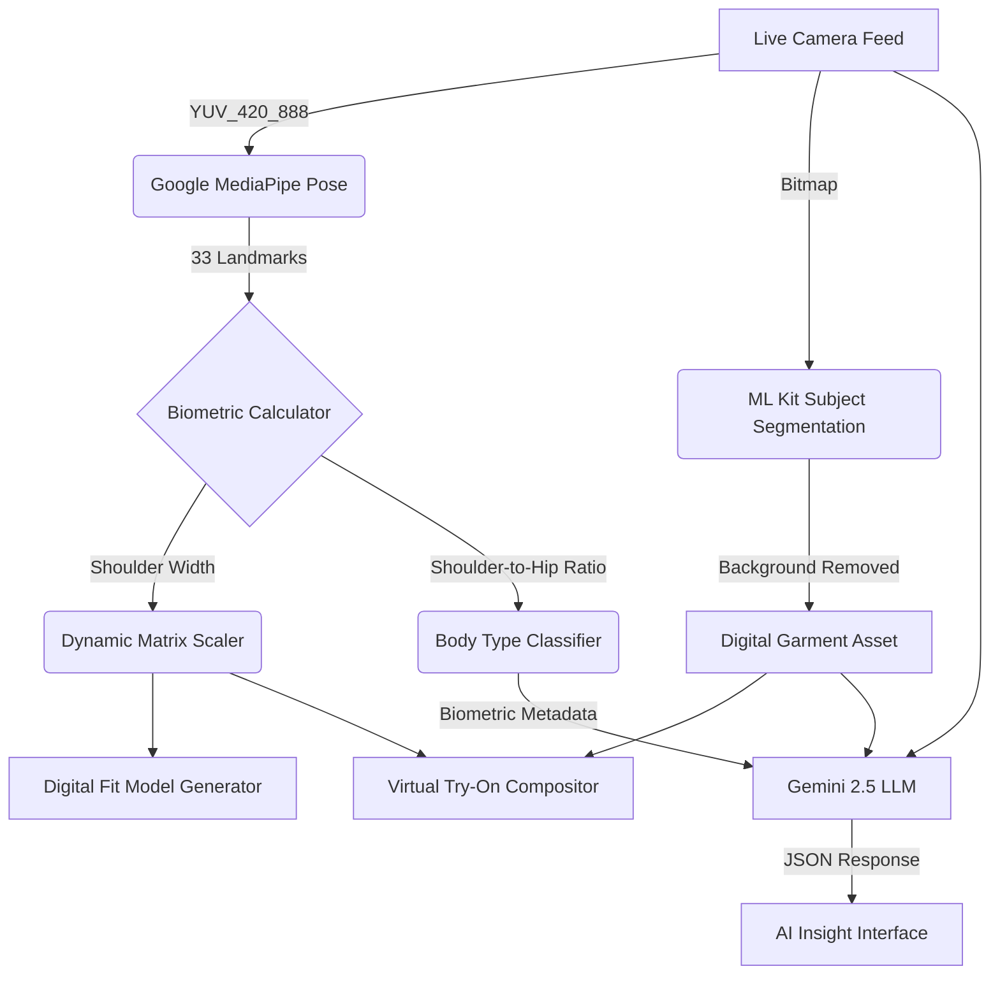

<div align="center">

# AvatarX — Real-Time Avatar & Body Tracking Application

<p align="center">
  <i>An advanced, on-device machine learning application bridging physical biometrics with digital identity.</i>
</p>

---


</div>

---

## 🌌 The Vision
**AvatarX** is not just an application; it is a "Fashion OS". It is a native Android experience designed to map human body mechanics into digital environments. By combining lightning-fast hardware-accelerated graphics with state-of-the-art AI, AvatarX extracts physical measurements, categorizes body types, and executes virtual garment try-ons without ever leaving your device.


## 1. Executive Summary

**AvatarX** is a next-generation "Fashion OS" designed to revolutionize virtual fitting and digital identity. Rather than relying on computationally expensive 3D game engines (e.g., Unity, Unreal) or environmentally restrictive augmented reality frameworks (e.g., ARCore), AvatarX leverages **Native Hardware-Accelerated Canvas Rendering** combined with **On-Device Machine Learning**. 

This approach yields a highly performant, lightweight application capable of extracting biometric proportions, segmenting physical garments in real-time, and generating personalized AI-driven stylist analyses—all within a seamless, glassmorphic UI.

---

## 📸 Application Showcase

> **Note to Reviewer:** See the project's root `docs/` folder or issue attachments for high-resolution screenshots of the Digital Fit Model, AI Insights, and Virtual Try-On interfaces.


---

## 2. System Architecture & Data Flow

AvatarX operates on a strict **Unidirectional Data Flow (UDF)** adhering to the MVVM architecture. The application is divided into three core subsystems: the Biometric Engine, the Segmentation Engine, and the Generative AI Engine.



---

## 3. Core Subsystems

### 3.1. The Biometric & Kinematic Engine
AvatarX captures complex bodily movements without requiring external depth sensors.
* **33-Point Skeleton Tracking:** Utilizes MediaPipe to extract high-fidelity spatial coordinates from a 2D camera feed.
* **Mathematical Proportion Extraction:** Implements an algorithm that maps pixel distances between the `LEFT_SHOULDER` and `RIGHT_SHOULDER` nodes, applying a normalization matrix to estimate physical centimeters.
* **Algorithmic Body Typing:** Uses the calculated `Shoulder Width : Hip Width` ratio to automatically classify the user's biomechanics into one of four distinct categories: `Slim`, `Regular`, `Athletic`, or `Broad`.

### 3.2. Native Hardware Rendering (The Digital Twin)
To maintain 60+ FPS while rendering complex visuals, AvatarX eschews heavy OpenGL/Vulkan wrappers.
* **Dynamic Wireframe Generation:** The app natively draws a "Digital Fit Model" directly onto the Android `Canvas`. The model's vertices are dynamically bound to the output of the Biometric Engine.
* **Matrix Scaling:** Garment assets are projected onto the user's feed using a custom `OverlayTransform` matrix, ensuring the digital clothing scales exponentially relative to the user's Z-axis depth.

### 3.3. Subject Segmentation
* **Instant Background Removal:** Incorporates Google ML Kit's Subject Segmentation API. When a garment is laid flat, the ML model identifies the primary subject mask and zeroes out the surrounding alpha channels, caching the result locally as a transparent PNG asset.

### 3.4. Generative AI Fashion Analysis
* **Multimodal LLM Integration:** AvatarX packages the user's captured body image, the segmented garment image, and the extracted numerical biometric data into a multimodal payload.
* **Stylist Inference:** This payload is sent to the **Gemini 2.5 Flash** endpoint via the Google Generative AI SDK. The model returns a structured JSON evaluation scoring the garment's *Comfort*, *Style Match*, and *Body Alignment*.

---

## 4. Technical Stack Matrix

| Domain | Technology / Framework | Justification |
| :--- | :--- | :--- |
| **Language** | Kotlin | Modern, concise, and offers unparalleled null-safety and coroutine support for asynchronous ML tasks. |
| **UI Rendering** | Jetpack Compose | Declarative UI paradigm drastically reduces UI lag and allows for complex `AnimatedContent` state transitions. |
| **Graphics** | Android Canvas (Skia) | Directly hardware-accelerated by the OS GPU; avoids the immense bloat of embedding a Unity scene. |
| **Camera Feed** | CameraX | Lifecycle-aware camera pipeline that natively handles hardware rotation and stream analysis. |
| **Machine Learning** | MediaPipe & ML Kit | Industry-standard, highly optimized C++ models deployed directly on-device for zero-latency inference. |
| **Generative AI** | Gemini 2.5 | Unmatched multimodal vision capabilities necessary for analyzing both body proportions and fabric aesthetics simultaneously. |

---

## 5. Build & Deployment Instructions

### System Requirements
* **IDE:** Android Studio (Koala Feature Drop or newer).
* **Hardware:** A physical Android testing device (API Level 29+). Emulators are strictly prohibited for accurate testing as they lack the camera hardware and GPU acceleration required for the Machine Learning pipelines.

### Setup Protocol

1. **Clone the Repository:**
   ```bash
   git clone https://github.com/zohaib-md/AvatarX.git
   cd AvatarX
   ```

2. **Configure API Authentication:**
   The AI Stylist subsystem requires a valid Gemini API key to authenticate network requests. 
   Navigate to the project root and append your key to `local.properties`:
   ```properties
   GEMINI_API_KEY=insert_your_secure_api_key_here
   ```

3. **Compile & Execute:**
   * Open the project directory in Android Studio.
   * Allow Gradle to resolve and sync all Maven dependencies.
   * Connect your physical Android device via USB/Wireless Debugging.
   * Execute the build sequence (`Shift + F10`).

---

<div align="center">
  <b>Designed and Engineered for the Smarrtifai Technical Assignment.</b>
</div>
